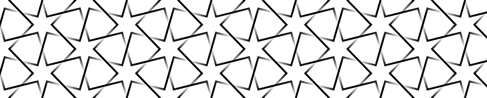
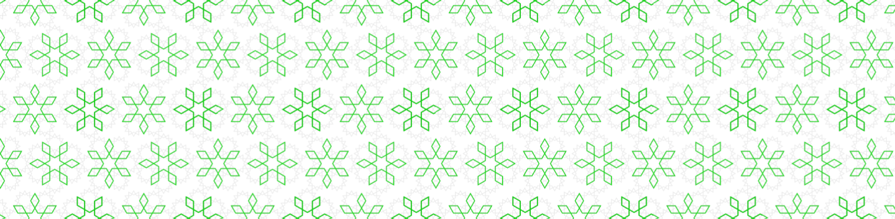
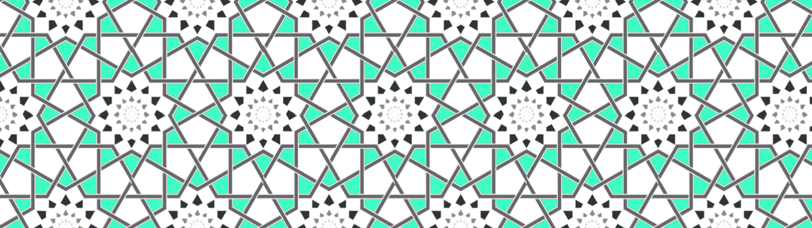
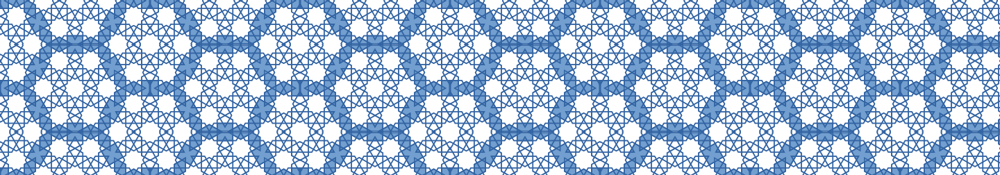
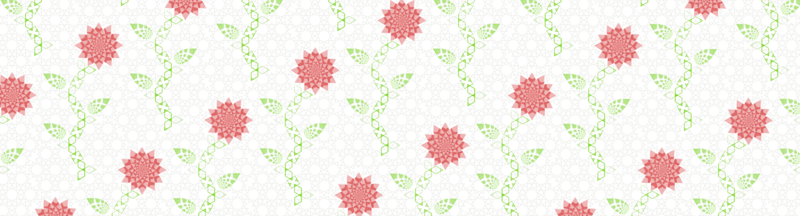

# Geometric-Motif

These patterns were made in Inkscape as experiments in a weekend workshop series taught by Xenia Ghazi 

Click the title to see the pattern full page -- it's an SVG tiled as a background image so you can zoom in and out with your browser.

## [6 fold Symmetry with interwoven edges](https://jazzyjackson.github.io/Geometric-Motif/complete/starcover.html)
136 KiB

## [Subset of Stars with two alternating rotations](https://jazzyjackson.github.io/Geometric-Motif/complete/snowflakes.html)
39 KiB

## [12 pointed stars repeating toward their centers](https://jazzyjackson.github.io/Geometric-Motif/complete/stones.html)
74 KiB

## [Interlocking rings composed of the space between groups of 7 stars](https://jazzyjackson.github.io/Geometric-Motif/complete/starring.html)
21 KiB

## [6 fold Symmetry in groups of 7, fractal 24 pointed petals and leaves](https://jazzyjackson.github.io/Geometric-Motif/complete/roses.html)
1.3 MB

[Xenia's website](http://xeniagazi.com/)

[The class description for Islamic Art: the Mastery of Geometry at SAIC](https://continuingstudies.saic.edu/islamic-art-mastery-geometry/1170-2373)
